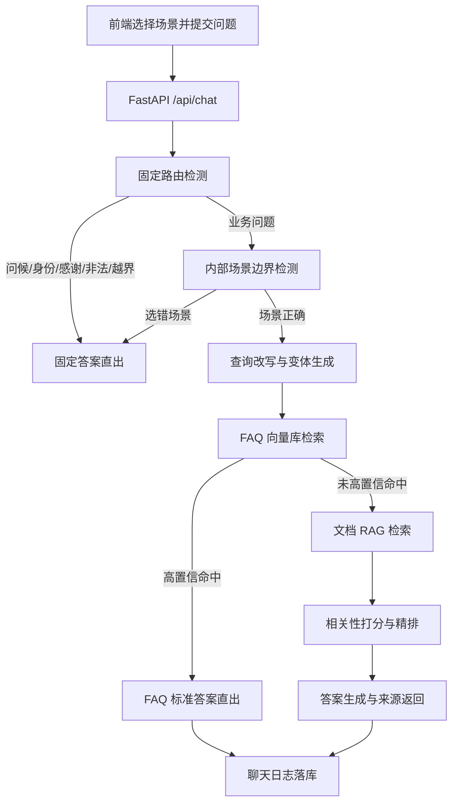
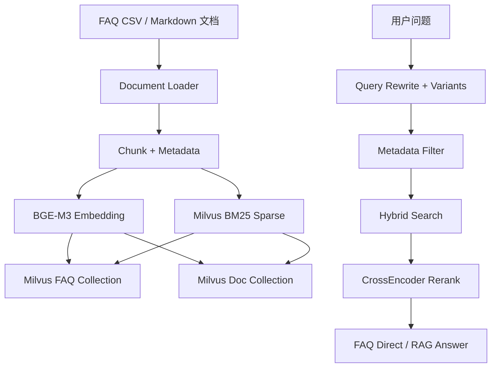

# 企业用工与社保合规智能平台二期 MVP 项目书

## 项目目标

在原 Dify 版 smart-labor-compliance 项目基础上，引入轻量 RAG 能力，形成“场景选择、多路由、FAQ 向量直出、文档检索增强、来源追溯、历史留存”的闭环 MVP。

## 二期场景

| 场景 | 覆盖内容 |
| --- | --- |
| 社保医保合规 | 社保参保、缴费基数、居民医保、家庭共济、异地就医 |
| 用工合规 | 劳动合同、试用期、最低工资、加班、离职、工资扣款 |
| 假期福利 | 产假、护理假、育儿假、年休假、病假 |
| 劳动争议办事 | 劳动仲裁、时效、材料、电话地址、办理路径 |

## MVP 闭环

## 技术路线

后端沿用 FastAPI、SQLAlchemy、MySQL、多租户和聊天日志。新增 `app/rag` 包承载二期 RAG 链路。知识库资料放在 `backend/rag_data`，按场景拆分 FAQ 与文档。

向量库设计采用 Milvus，索引参数使用 IVF_PQ。真实 RAG 模式下，系统使用 LangChain Milvus VectorStore、本地 BGE-M3 Embedding、Milvus BM25BuiltInFunction、dense+sparse Hybrid Search 和 BGE CrossEncoder Reranker 完成 FAQ 与文档检索。MVP 本地运行时保留轻量向量检索兜底，方便未启动 Docker/Milvus 时演示业务闭环。

## RAG 技术架构

## 交付范围

- 前端场景选择
- 后端多路由和边界检测
- 四场景 FAQ 向量知识库资料
- 文档 RAG 检索与来源返回
- Milvus Docker Compose
- 知识库重建脚本，支持 `manifest` 与 `milvus` 两种模式
- 二期业务图、代码架构图、实施步骤、人员分工
