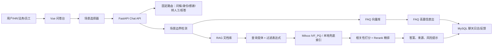

# 二期业务框架图

```mermaid
flowchart LR
  U["用户/HR/法务/员工"] --> FE["Vue 问答台"]
  FE --> S["场景选择器"]
  S --> API["FastAPI Chat API"]
  API --> R1["固定路由：问候/身份/感谢/转人工/拒答"]
  API --> R2["场景边界检测"]
  R2 --> KB1["FAQ 向量库"]
  R2 --> KB2["RAG 文档库"]
  KB1 --> A1["FAQ 高置信直出"]
  KB2 --> Q["查询变体 + 过滤表达式"]
  Q --> M["Milvus IVF_PQ / 本地兜底索引"]
  M --> RR["相关性打分 + Rerank 精排"]
  RR --> ANS["答案、来源、风险提示"]
  A1 --> LOG["MySQL 聊天日志/反馈"]
  ANS --> LOG
```

## 业务边界

| 层级 | 规则 |
| --- | --- |
| 平台边界 | 非企业用工、社保医保、假期福利、劳动争议办事问题直接提示越界 |
| 安全边界 | 非法、色情、暴力、伪造证件等内容固定拒答 |
| 场景边界 | 社保问题必须在社保医保场景，仲裁问题必须在劳动争议场景 |
| 知识边界 | 无检索依据时提示资料不足，不编造政策结论 |

