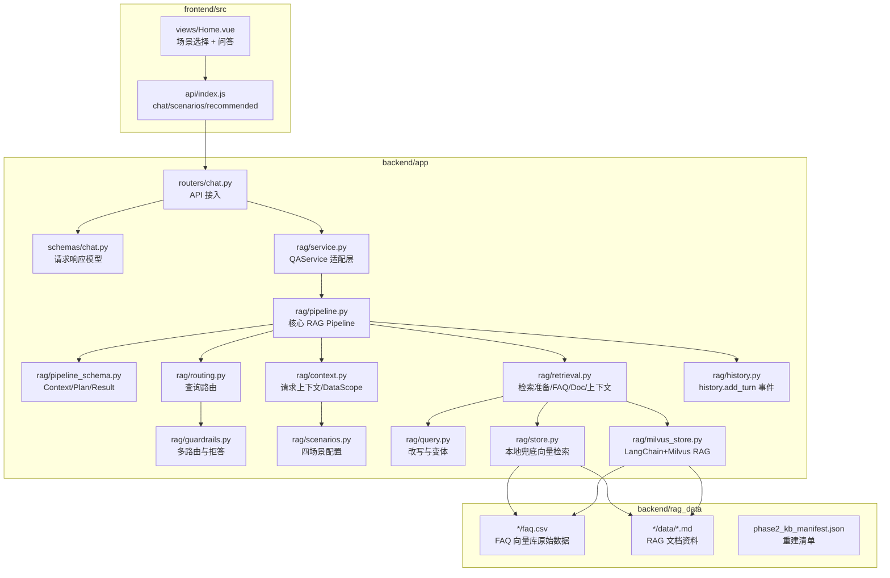

# 二期代码架构图

## 关键文件

| 文件 | 作用 |
| --- | --- |
| `backend/app/rag/service.py` | QAService 适配层，负责 validate_source、调用 Pipeline、转换 ChatResponse |
| `backend/app/rag/pipeline.py` | 严格按核心 RAG 链路流程图编排主流程 |
| `backend/app/rag/pipeline_schema.py` | 定义 RAGQueryContext、DataScope、RetrievalPlan、RetrievalPreparation、RAGPipelineResult |
| `backend/app/rag/context.py` | 创建请求上下文和数据域 |
| `backend/app/rag/routing.py` | 查询路由，决定直出、越界或进入检索 |
| `backend/app/rag/retrieval.py` | 检索准备、Active KB 版本、FAQ 检索、Doc 检索、上下文筛选 |
| `backend/app/rag/history.py` | history.add_turn 事件适配，数据库写入仍由原 API 层完成 |
| `backend/app/rag/guardrails.py` | 问候、身份、非法、越界、内部场景边界 |
| `backend/app/rag/store.py` | FAQ 与文档向量检索、相关性打分、精排 |
| `backend/app/rag/milvus_store.py` | 真实 LangChain + Milvus + BGE + BM25 + Rerank 路径 |
| `backend/app/rag/scenarios.py` | 四个业务场景定义 |
| `frontend/src/views/Home.vue` | 前端场景选择与问答提交 |
| `docker-compose.milvus.yml` | Milvus、Etcd、MinIO 容器 |
| `backend/scripts/rebuild_phase2_kb.py` | 知识库重建清单脚本 |
