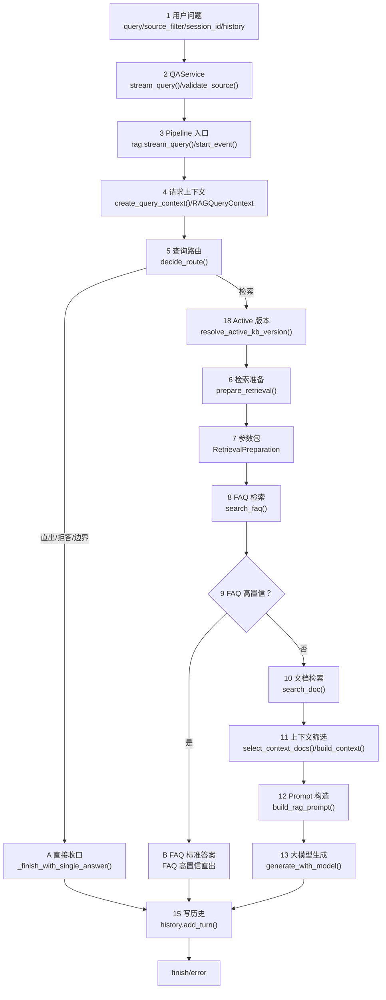

# RAG 技术实现说明

二期 MVP 已经把 RAG 技术做成两层实现：

| 层级 | 作用 | 文件 |
| --- | --- | --- |
| 本地兜底索引 | 不启动 Milvus 也能跑通 MVP 闭环 | `backend/app/rag/store.py` |
| 真实 RAG 向量库 | LangChain + Milvus + BGE + BM25 + Rerank | `backend/app/rag/milvus_store.py` |

默认使用本地兜底索引，便于演示；设置 `PHASE2_VECTOR_BACKEND=milvus` 后，后端会切换到真实 Milvus RAG 检索。

## 使用到的 RAG 技术

| RAG 技术 | 实现方式 | 代码位置 |
| --- | --- | --- |
| 场景路由 | 四个内部场景配置，前端选择 `scenario_id` | `backend/app/rag/scenarios.py` |
| 多路由直出 | 问候、身份、感谢、非法、越界固定回答 | `backend/app/rag/guardrails.py` |
| 场景边界检测 | 推断问题所属场景，与前端选择场景比较 | `backend/app/rag/guardrails.py` |
| FAQ 向量库 | FAQ CSV 转 Document，写入 FAQ collection | `backend/app/rag/milvus_store.py` |
| FAQ 高置信直出 | FAQ top score 达阈值直接返回标准答案 | `backend/app/rag/service.py` |
| Pipeline 事件追踪 | 每次请求返回 start、route、search、finish 等事件 | `backend/app/rag/pipeline.py` |
| Active KB 版本 | `PHASE2_KB_VERSION` 模拟 MySQL active pointer | `backend/app/rag/retrieval.py` |
| DataScope 数据域 | tenant、roles、visibility、province、city 隔离 | `backend/app/rag/context.py` |
| Prompt 构造 | 把问题、场景、角色、地区、检索上下文组装为模型输入 | `backend/app/rag/generator.py` |
| 大模型生成 | 支持 Dify 和 OpenAI-compatible Chat Completions | `backend/app/rag/generator.py` |
| 查询改写 | 对追问拼接历史上下文，形成独立查询；可选 LLM 生成 `rewritten_query` | `backend/app/rag/query.py` |
| 查询变体 | 社保/医保/仲裁/产假等同义词扩展；可选 LLM 生成更多检索变体 | `backend/app/rag/query.py` |
| 动态检索计划 | 根据规则或 LLM `query_type` 动态调整 FAQ 阈值、top_k、上下文数量 | `backend/app/rag/retrieval.py` |
| LangChain | 用 `langchain_milvus.Milvus` 管理 VectorStore | `backend/app/rag/milvus_store.py` |
| BGE-M3 Embedding | 用 `HuggingFaceEmbeddings` 加载本地模型 | `backend/app/rag/milvus_store.py` |
| Milvus Hybrid Search | dense + sparse 双字段检索 | `backend/app/rag/milvus_store.py` |
| BM25 稀疏检索 | `BM25BuiltInFunction` 服务端生成 sparse | `backend/app/rag/milvus_store.py` |
| IVF_PQ | dense 向量索引参数 `IVF_PQ/COSINE` | `backend/app/rag/store.py` |
| 过滤表达式 | scenario/source_type/tenant/kb_version 隔离 | `backend/app/rag/store.py` |
| 相关性打分 | 检索分数、关键词分数、精排分数 | `backend/app/rag/store.py`、`milvus_store.py` |
| Rerank 精排 | BGE CrossEncoder 对召回结果重排 | `backend/app/rag/milvus_store.py` |
| 来源追溯 | answer 返回 `sources` 与 score snippet | `backend/app/rag/service.py` |

## 真实 Milvus RAG 运行方式

1. 启动 Milvus：

```powershell
docker compose -f docker-compose.milvus.yml up -d
```

2. 在 `RAG` 环境安装后端依赖：

```powershell
E:\anaconda\envs\RAG\python.exe -m pip install -r backend\requirements.txt
```

3. 设置真实 RAG 后端：

```powershell
$env:PHASE2_VECTOR_BACKEND="milvus"
$env:MILVUS_URI="http://127.0.0.1:19530"
$env:EMBEDDING_MODEL_PATH="C:\Users\k1502\Desktop\Project\smart-labor-compliance-phase2-mvp\model\bge-m3"
$env:RERANKER_MODEL_PATH="C:\Users\k1502\Desktop\Project\smart-labor-compliance-phase2-mvp\model\bge-reranker-large"
```

4. 重建真实向量库：

```powershell
E:\anaconda\envs\RAG\python.exe backend\scripts\rebuild_phase2_kb.py --backend milvus --reset-collections
```

5. 启动后端：

```powershell
cd backend
E:\anaconda\envs\RAG\python.exe -m uvicorn app.main:app --reload --host 127.0.0.1 --port 8000
```

## 为什么保留本地兜底索引

完整 RAG 依赖 Milvus、BGE 模型、Reranker 和 Python 包。为了让 MVP 在课堂、评审或没有 Docker 的电脑上仍能演示完整业务流程，系统默认启用本地兜底索引。

这不是替代 RAG，而是工程上的 fallback。正式验收和生产演示应使用：

```text
PHASE2_VECTOR_BACKEND=milvus
```

## 二期 RAG 主链路



## 普通问答的大模型调用规则

普通 `/api/chat` 现在已经是完整 RAG 生成闭环：

```text
场景路由 -> FAQ 检索 -> 文档检索 -> 上下文筛选 -> Prompt 构造 -> Dify/LLM 生成 -> 写历史
```

但为了节省费用和降低风险，并不是所有问题都调用大模型：

| 情况 | 是否调用大模型 |
| --- | --- |
| 问候、身份、感谢、非法、越界 | 不调用，固定直出 |
| 内部场景选错 | 不调用，提示切换场景 |
| FAQ 高置信命中 | 不调用，FAQ 标准答案直出 |
| 检索不到可靠上下文 | 不调用，信息不足收口 |
| FAQ 未命中且文档上下文可靠 | 调用 Dify 或 OpenAI-compatible 大模型 |

生成层配置：

```text
PHASE2_GENERATION_BACKEND=auto
DIFY_API_KEY=
DIFY_BASE_URL=http://127.0.0.1/v1
PHASE2_LLM_BASE_URL=https://api.openai.com/v1
PHASE2_LLM_API_KEY=
PHASE2_LLM_MODEL=gpt-4o-mini
```

`auto` 模式含义：

1. 如果配置了 `DIFY_API_KEY`，优先调用 Dify。
2. 如果配置了 `PHASE2_LLM_API_KEY`，调用 OpenAI-compatible Chat Completions。
3. 如果都没有配置，使用模板兜底，并在 `retrieval.generation` 里记录 `used_llm=false`。

## 查询变体的大模型调用规则

查询规划阶段也预留了大模型能力，用来生成动态检索计划和问题变体。默认不开启，避免本地 MVP 没有 Key 时无法运行。

| 配置项 | 默认值 | 作用 |
| --- | --- | --- |
| `PHASE2_QUERY_LLM_ENABLED` | `false` | 是否启用大模型查询规划 |
| `PHASE2_QUERY_LLM_BACKEND` | `openai_compatible` | 查询规划后端，MVP 当前支持 OpenAI-compatible |
| `PHASE2_QUERY_LLM_MAX_VARIANTS` | `4` | 最多生成多少条查询变体 |
| `PHASE2_QUERY_LLM_TEMPERATURE` | `0.1` | 查询规划温度，建议保持低温稳定 |
| `PHASE2_LLM_API_KEY` | 空 | 查询规划和最终答案生成共用的大模型 API Key |

开启方式：

```powershell
$env:PHASE2_QUERY_LLM_ENABLED="true"
$env:PHASE2_LLM_BASE_URL="https://api.openai.com/v1"
$env:PHASE2_LLM_API_KEY="你的 API Key"
$env:PHASE2_LLM_MODEL="gpt-4o-mini"
```

开启后，链路会变成：

```text
用户问题 -> LLM 查询规划 -> rewritten_query/query_variants/query_type
-> 动态检索计划 -> FAQ 向量检索 -> 文档混合检索 -> Prompt -> 大模型整理答案
```

未配置 Key 或模型调用失败时，系统不会报错中断，而是自动回到本地规则：

```text
规则追问改写 -> 规则同义词变体 -> 规则 query_type 分类 -> 混合检索
```

验收时可以查看接口返回：

```text
retrieval.profile.query_llm_enabled
retrieval.profile.query_llm_used
retrieval.profile.query_llm_provider
retrieval.profile.query_llm_type_hint
retrieval.query_variants
retrieval.plan.reasons
```

如果 `query_llm_used=true`，说明问题变体和动态检索计划已经使用大模型参与；如果 `query_llm_used=false`，说明当前走的是规则兜底。

## 混合检索后的答案整理

FAQ 未高置信直出时，系统会执行 FAQ + 文档混合检索，并把筛选后的上下文送入 `build_rag_prompt()`。随后由 `generate_with_model()` 决定是否调用大模型整理最终答案。

| 生成后端 | 配置方式 | 行为 |
| --- | --- | --- |
| Dify | `PHASE2_GENERATION_BACKEND=auto` 且 `DIFY_API_KEY` 不为空 | 把检索上下文组装成 Prompt 后调用 Dify `/chat-messages` |
| OpenAI-compatible | `PHASE2_GENERATION_BACKEND=auto` 且 `PHASE2_LLM_API_KEY` 不为空 | 调用兼容 `/v1/chat/completions` 的模型网关 |
| 模板兜底 | 未配置 Dify/LLM Key 或模型失败 | 不编造答案，只基于命中文档片段生成简短兜底 |

因此完整 RAG 链路中，大模型有两个可选位置：

| 位置 | 文件 | 作用 | 默认是否开启 |
| --- | --- | --- | --- |
| 检索前 | `backend/app/rag/query.py` | 生成问题改写、查询变体、query_type | 否 |
| 检索后 | `backend/app/rag/generator.py` | 整理混合检索上下文，生成最终回答 | 有 Key 时自动开启 |

## 返回中的可验收字段

每次 `/api/chat` 响应的 `retrieval` 字段会包含以下关键诊断信息，证明 RAG 链路真实执行：

| 字段 | 含义 |
| --- | --- |
| `events` | Pipeline 事件列表，例如 `start`、`prepare_retrieval`、`search_faq`、`search_doc`、`finish` |
| `kb_version` | 当前知识库版本，默认 `phase2_mvp` |
| `data_scope` | tenant、roles、visibility、province、city |
| `query_variants` | 查询变体列表 |
| `faq_filter_expr` / `doc_filter_expr` | Milvus 标量过滤表达式 |
| `ivf_pq_index_params` | IVF_PQ 索引参数 |
| `faq_top_score` / `doc_top_score` | FAQ 与文档最高相关性分数 |

## 回答来源标记

本次补充后，`/api/chat` 的顶层响应会返回 `answer_source`，同时 `retrieval.answer_source` 与 `retrieval.answer_source_label` 也会返回同样的来源诊断。前端首页会在回答标题右侧显示“回答来源”标签。

| `answer_source` | 前端显示 | 含义 | 是否调用 FAQ | 是否调用文档检索 | 是否调用大模型 |
| --- | --- | --- | --- | --- | --- |
| `router_direct` | 路由直出 | 问候、身份、感谢、转人工、非法拒答、明显平台外问题等固定答复 | 否 | 否 | 否 |
| `scene_boundary` | 场景边界直出 | 问题属于另一个内部场景，提示用户切换场景 | 否 | 否 | 否 |
| `faq_direct` | FAQ 向量库直出 | FAQ 向量检索 top1 分数达到动态阈值，直接返回标准答案 | 是 | 否 | 否 |
| `hybrid_retrieval_llm` | 混合检索 + 大模型生成 | FAQ 未高置信直出，文档混合检索提供上下文，再调用 Dify 或 OpenAI-compatible LLM 生成 | 是 | 是 | 是 |
| `hybrid_retrieval_template` | 混合检索 + 模板兜底 | FAQ 未高置信直出，文档混合检索提供上下文，但本地未配置 Dify/LLM Key 或模型调用失败，使用模板兜底 | 是 | 是 | 否 |
| `error` | 异常兜底 | Pipeline 捕获异常后的可恢复兜底 | 不确定 | 不确定 | 不确定 |

本地 MVP 默认没有强制配置外部大模型 Key，因此很多非 FAQ 问题会显示 `hybrid_retrieval_template`。这不代表没有执行 RAG；可以在 `retrieval.events`、`query_variants`、`plan`、`faq_top_score`、`doc_top_score`、`sources` 中看到真实检索过程。配置 `DIFY_API_KEY` 或 `PHASE2_LLM_API_KEY` 后，同一条链路会在有可靠上下文时进入 `hybrid_retrieval_llm`。

## 动态检索计划与变体

`prepare_retrieval()` 会先判断是否追问，然后执行查询改写、场景意图识别、查询变体生成和动态检索计划生成。计划信息会放在 `retrieval.plan` 中：

| 字段 | 含义 |
| --- | --- |
| `plan_name` | 本次采用的检索计划，例如 `faq_fast_path`、`broad_policy`、`procedure_deep_context`、`dispute_scene_deep_context` |
| `query_type` | 问题类型，例如 `faq_like`、`policy`、`procedure`、`dispute`、`follow_up` |
| `faq_top_k` / `doc_top_k` | FAQ 与文档召回数量 |
| `faq_direct_threshold` | FAQ 直出阈值，会随问题类型动态变化 |
| `min_context_score` / `max_context_docs` | 进入 Prompt 的最低分与最大上下文数量 |
| `reasons` | 生成该计划的原因，便于验收和调试 |

查询变体在 `retrieval.query_variants` 中返回，例如“社保”会扩展为“社会保险”，“劳动仲裁”会扩展为“劳动争议仲裁”，“需要什么”会扩展为“申请材料”。检索层会对多个变体执行 FAQ 与文档召回，以提高命中率。
