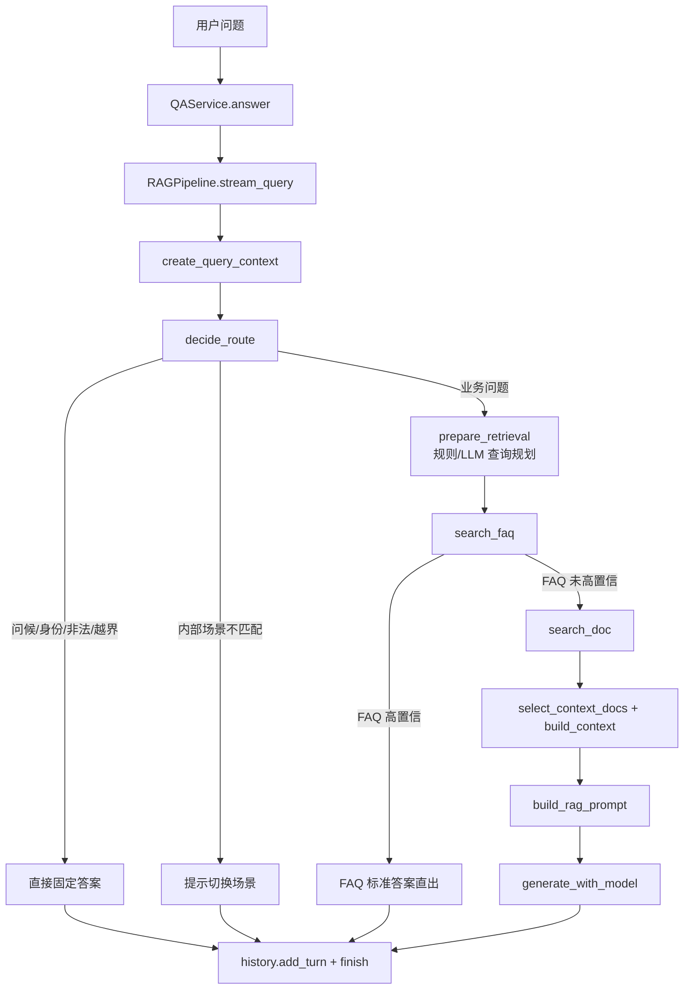

# 核心 RAG 链路流程图对齐说明

本说明用于对齐你提供的 `F:/RAG/04_代码/核心RAG链路流程.drawio`。二期 MVP 已按图中的节点拆分后端代码，保证不是只有文档描述，而是可以在 `/api/chat` 返回的 `retrieval.events` 中看到实际执行链路。

## 节点到代码映射

| 流程图节点 | 代码文件 | 函数/对象 |
| --- | --- | --- |
| 1 用户问题 | `backend/app/routers/chat.py` | `chat()` 接收 `question/scenario_id/session_id` |
| 2 QAService | `backend/app/rag/service.py` | `Phase2RAGService.answer()`、`validate_source()` |
| 3 Pipeline 入口 | `backend/app/rag/pipeline.py` | `RAGPipeline.stream_query()`、`start_event()` |
| 4 请求上下文 | `backend/app/rag/context.py` | `create_query_context()`、`RAGQueryContext` |
| 5 查询路由 | `backend/app/rag/routing.py` | `decide_route()` |
| A 直接收口 | `backend/app/rag/pipeline.py` | `_finish_with_single_answer()` |
| 17 场景/数据域 | `backend/app/rag/context.py`、`pipeline_schema.py` | `DataScope` |
| 18 Active 版本 | `backend/app/rag/retrieval.py` | `resolve_active_kb_version()` |
| 6 检索准备 | `backend/app/rag/retrieval.py` | `prepare_retrieval()` |
| 7 参数包 | `backend/app/rag/pipeline_schema.py` | `RetrievalPreparation`、`RetrievalPlan` |
| 历史改写 | `backend/app/rag/query.py` | `rewrite_query_if_needed()`、`prepare_query_with_optional_llm()` |
| 检索计划与查询变体 | `backend/app/rag/retrieval.py`、`query.py` | `build_retrieval_plan()`、`generate_query_variants()`、LLM `query_type` hint |
| 8 FAQ 检索 | `backend/app/rag/retrieval.py` | `search_faq()` |
| 9 FAQ 高置信 | `backend/app/rag/retrieval.py` | `faq_direct_answer()` |
| B FAQ 标准答案 | `backend/app/rag/pipeline.py` | `_finish_with_single_answer()` |
| 10 文档检索 | `backend/app/rag/retrieval.py` | `search_doc()` |
| Milvus Hybrid Search 内部 | `backend/app/rag/milvus_store.py` | `search_milvus()`、`rerank_hits()` |
| 11 上下文筛选 | `backend/app/rag/retrieval.py` | `select_context_docs()`、`build_context()` |
| 12 Prompt 构造 | `backend/app/rag/generator.py` | `build_rag_prompt()` |
| 13 大模型生成 | `backend/app/rag/generator.py` | `generate_with_model()`、`_generate_with_dify()`、`_generate_with_openai_compatible()` |
| 信息不足收口 | `backend/app/rag/pipeline.py` | `generate_answer()` 无上下文分支 |
| 15 写历史 | `backend/app/rag/history.py`、`routers/chat.py` | `add_turn()`、`_persist_chat_log()` |
| 异常收口 | `backend/app/rag/pipeline.py` | `finish_error` 事件 |

## 四条主要执行路径



## 验收样例

| 输入 | 场景 | 预期路由 |
| --- | --- | --- |
| `你是谁` | 任意 | `direct_answer` |
| `员工自愿放弃社保可以吗` | 社保医保合规 | `faq_direct` |
| `劳动仲裁需要什么材料` | 社保医保合规 | `scene_boundary` |
| `试用期可以不签劳动合同吗` | 用工合规 | `rag` |

## 检查返回事件

正常 RAG 路径应包含：

```text
start -> create_query_context -> decide_route -> resolve_active_kb_version
-> prepare_retrieval -> search_faq -> search_doc -> select_context_docs
-> build_prompt -> llm_generate -> history.add_turn -> finish
```

FAQ 高置信路径应包含：

```text
start -> create_query_context -> decide_route -> resolve_active_kb_version
-> prepare_retrieval -> search_faq -> history.add_turn -> finish
```

直出路径应包含：

```text
start -> create_query_context -> decide_route -> history.add_turn -> finish
```

如果开启了 `PHASE2_QUERY_LLM_ENABLED=true` 且配置了 `PHASE2_LLM_API_KEY`，`prepare_retrieval` 内部会额外执行 LLM 查询规划，但事件名称仍归并在 `prepare_retrieval` 阶段。可在返回 JSON 中检查：

```text
retrieval.profile.query_llm_enabled = true
retrieval.profile.query_llm_used = true
retrieval.profile.query_llm_type_hint = policy/procedure/dispute/faq_like/general/follow_up
retrieval.query_variants = LLM 变体 + 规则变体去重后的列表
retrieval.plan.reasons 包含 query_type_hint_from_llm
```

如果没有 API Key 或模型调用失败，则 `query_llm_used=false`，系统自动使用规则查询改写与规则变体，不影响后续 FAQ 和文档混合检索。

## 回答来源与流程图分支

接口返回的 `answer_source` 用于验收“这次答案从哪里来”。它和流程图分支的对应关系如下：

| 流程图分支 | `route` | `answer_source` | 说明 |
| --- | --- | --- | --- |
| A 直接收口 | `direct_answer` | `router_direct` | 问候、身份、感谢、转人工、非法拒答、平台外问题等固定回复 |
| A 直接收口 | `scene_boundary` | `scene_boundary` | 内部场景不匹配，提示用户切换到正确场景 |
| B FAQ 标准答案 | `faq_direct` | `faq_direct` | FAQ 向量库高置信命中，不再调用文档检索和大模型 |
| 10-13 文档 RAG 生成 | `rag` | `hybrid_retrieval_llm` | FAQ 未高置信，执行文档混合检索、Prompt 构造，并调用 Dify/LLM |
| 10-13 文档 RAG 兜底 | `rag` | `hybrid_retrieval_template` | FAQ 未高置信，执行文档混合检索，但本地未配置 Dify/LLM Key 或模型调用失败，使用模板兜底 |
| error | `error` | `error` | Pipeline 捕获异常后的可恢复提示 |

前端首页展示的是 `answer_source_label`。如果只看接口 JSON，可同时检查：

```text
answer_source
retrieval.answer_source
retrieval.answer_source_label
retrieval.events
retrieval.plan
retrieval.query_variants
retrieval.generation
```

## 本地默认模式说明

Local MVP 默认模式会完整执行“路由 -> FAQ 向量检索 -> 文档混合检索 -> 上下文筛选 -> Prompt 构造”链路。区别在于本地默认未配置外部大模型 Key，所以生成层会记录：

```text
retrieval.generation.used_llm = false
retrieval.generation.reason = no generation backend configured
answer_source = hybrid_retrieval_template
```

这表示 RAG 混合检索已经执行，只是最后没有调用外部大模型。配置 `DIFY_API_KEY` 或 `PHASE2_LLM_API_KEY` 后，有可靠上下文的普通 RAG 问题会变为：

```text
retrieval.generation.used_llm = true
answer_source = hybrid_retrieval_llm
```

如果还需要让大模型参与“问题变体生成”和“动态检索计划”，再额外开启：

```text
PHASE2_QUERY_LLM_ENABLED=true
PHASE2_QUERY_LLM_BACKEND=openai_compatible
PHASE2_QUERY_LLM_MAX_VARIANTS=4
PHASE2_QUERY_LLM_TEMPERATURE=0.1
```
