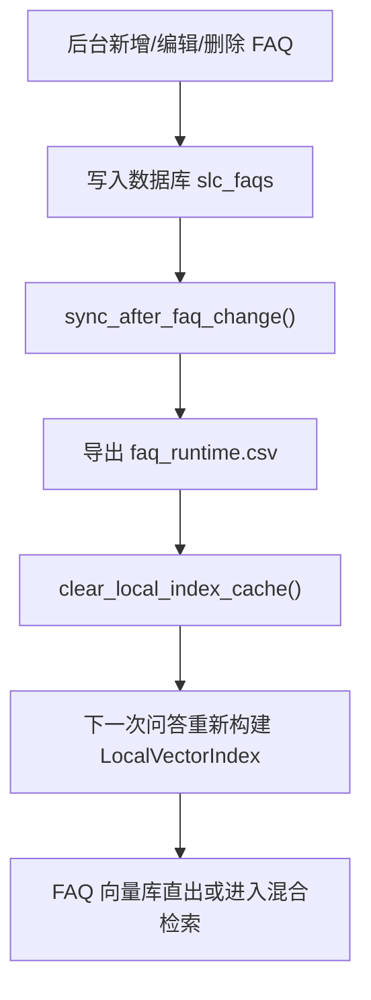

# 知识库实时更新说明

本项目已实现 MVP 级知识库实时更新闭环，目标是让后台 FAQ 改动后尽快进入 RAG 检索链路。

## 实现范围

| 模式 | 支持能力 | 说明 |
| --- | --- | --- |
| Local MVP | FAQ 新增、编辑、删除、导入、批量操作后立即清空本地索引缓存 | 下一次问答会重新读取 `faq.csv` 和 `faq_runtime.csv` |
| Milvus | 提供后台接口触发 Milvus 全量重建 | 因 Embedding 和索引构建耗时较长，不在每次 FAQ 保存时同步阻塞 |

## 核心文件

| 文件 | 作用 |
| --- | --- |
| `backend/app/rag/knowledge_sync.py` | 知识库同步入口，负责导出 runtime FAQ、清本地缓存、触发 Milvus 重建 |
| `backend/app/rag/store.py` | 本地索引新增 `clear_local_index_cache()`，FAQ 加载同时读取 `faq.csv` 和 `faq_runtime.csv` |
| `backend/app/routers/admin.py` | FAQ 增删改导入批量操作后调用 `sync_after_faq_change()`，并新增 RAG 管理接口 |
| `frontend/src/views/admin/Packages.vue` | 知识包页面增加 RAG 状态、刷新本地 RAG、重建 Milvus 按钮 |

## Local MVP 更新链路



后台 FAQ 不直接覆盖原始 `backend/rag_data/*/faq.csv`，而是导出到每个场景目录下的 `faq_runtime.csv`。这样可以区分“项目内置知识”和“后台运营知识”。

## 后台接口

| 方法 | 地址 | 权限 | 作用 |
| --- | --- | --- | --- |
| `GET` | `/api/admin/rag/sync-status` | `faqs` | 查看当前向量后端、本地缓存、runtime 文件和最近同步动作 |
| `POST` | `/api/admin/rag/reload-local-cache` | `faqs` | 手动清空本地 RAG 索引缓存 |
| `POST` | `/api/admin/rag/rebuild-milvus` | `packages` | 重建 Milvus FAQ/文档向量库 |

Milvus 重建请求示例：

```json
{
  "reset_collections": true
}
```

## 如何验证

1. 启动项目：

```powershell
.\start_project.bat
```

2. 打开后台 FAQ 页面，新增一条社保相关 FAQ。

3. 回到首页，选择“社保医保合规”场景，直接询问刚新增的问题。

4. 如果命中高置信 FAQ，页面会显示：

```text
回答来源: FAQ 向量库直出
回答引擎: phase2_faq_vector
```

5. 打开“知识包管理”页面，点击 `RAG 状态` 可以看到最近一次同步动作。

## Milvus 模式使用

启动 Milvus 后设置：

```powershell
$env:PHASE2_VECTOR_BACKEND="milvus"
$env:MILVUS_URI="http://127.0.0.1:19530"
```

然后在后台“知识包管理”点击 `重建 Milvus`，或直接调用：

```powershell
Invoke-RestMethod `
  -Method Post `
  -Uri http://127.0.0.1:8001/api/admin/rag/rebuild-milvus `
  -Headers @{ Authorization = "Bearer <admin_token>" } `
  -ContentType "application/json" `
  -Body '{"reset_collections": true}'
```

## 当前 MVP 边界

- Local MVP 可以做到 FAQ 改完下一次问答立即生效。
- Milvus MVP 采用“后台触发全量重建”，还不是逐条 upsert/delete。
- 文档资料 Source 上传后暂未自动切片入库，仍建议通过重建脚本或后续三期扩展实现文件级实时同步。
