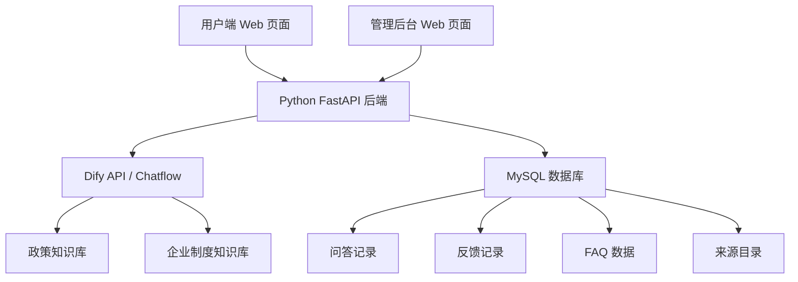

# 基于 Dify + Python + MySQL 的企业用工与社保合规智能平台项目书

## 一、项目概述

### 1. 项目名称

企业用工与社保合规智能平台

### 2. 项目定位

本项目不是单一地区政策问答工具，也不是纯演示型聊天页面，而是一个面向企业客户的人力资源与用工合规场景的商业化智能平台。

平台通过 `Dify + Python + MySQL` 技术路线，整合国家劳动法、地方社保政策、医保办事规则、劳动争议处理路径、企业内部制度和业务资料，形成一个可交付、可扩展、可商品化的 `企业合规智能助手产品`。

### 3. 项目周期

- 当前阶段：`1 周`
- 当前目标：完成可演示的商业化 `MVP`

### 4. 团队规模

- `10 人`

### 5. 核心技术栈

- Dify
- Python
- FastAPI
- MySQL
- Vue 3 / Vite / JavaScript
- 可选 Nginx / Docker

### 6. 技术选型优势

- Dify 负责 AI 工作流、Prompt 编排和模型接入，便于把智能能力从业务系统中解耦出来，后续可按客户或知识包独立调优。
- Python + FastAPI 适合快速交付企业级 API，天然支持类型校验和接口文档，方便 1 周 MVP 内完成问答、后台和验收接口闭环。
- MySQL 用于保存租户、账号、FAQ、来源目录、问答日志、反馈和知识包映射，具备成熟的备份、权限和运维方案。
- Vue 3 + Vite 能快速构建问答台和管理后台，开发反馈快，组件化能力足以支撑后续多租户、国际化和权限页面扩展。
- RAGFlow 作为资料治理和知识整理辅助，适合处理政策原文、网页、知识卡和人工复核链路，提升回答来源的可追溯性。
- JWT、bcrypt、敏感信息脱敏、限流与租户隔离共同构成 SaaS 化交付所需的基础安全边界。

### 7. 当前 MVP 场景定位

为了快速形成可落地样品，本项目首期选定：

**“陕西地区企业用工与社保合规场景”**

作为第一批知识包和试点区域。

也就是说：

- **平台本身**：企业用工与社保合规智能平台
- **首期场景包**：陕西社保与劳动法知识助手

---

## 二、项目背景

### 1. 市场背景

当前企业在人力资源管理、劳动用工、社保缴纳、医保政策、假期管理、劳动风险控制等方面面临持续性政策变化和执行压力。尤其对中小企业、集团区域分公司、外包服务机构、代理服务机构而言：

- 政策变化频繁
- 用工合规要求提高
- 社保与医保规则地区差异大
- 人事专员依赖经验答复，效率不稳定
- 员工高频提问消耗 HR 与行政大量时间

在这种背景下，传统的“靠人记规则、靠表格查政策、靠老员工传经验”的方式，越来越难支撑企业管理效率和合规要求。

### 2. 企业痛点

目标客户通常会遇到以下问题：

#### 2.1 政策碎片化

- 国家法律、地方政策、办事规则分散在不同官网和通知中
- 很多问题需要跨劳动法、医保、人社、税务多个口径理解

#### 2.2 地区差异大

- 最低工资、居民医保、产假护理假、灵活就业养老等规则存在明显地方差异
- 总部统一管理时，常无法兼顾各地区执行口径

#### 2.3 HR 与行政重复答疑成本高

- 员工反复问请假、产假、加班、社保、医保、报销、仲裁路径等问题
- 人事专员大量时间消耗在重复性问答

#### 2.4 知识沉淀弱

- 企业制度、FAQ、政策截图、办事经验散落
- 没有形成标准化知识资产

#### 2.5 风险控制难

- 个案问题很难快速判断风险等级
- 员工、HR、管理层缺少统一知识入口和办事依据

### 3. 项目建设意义

建设企业用工与社保合规智能平台，能够为企业带来以下价值：

- 建立统一合规知识入口
- 降低政策查询和重复答疑成本
- 提高 HR 处理效率和一致性
- 沉淀地区化政策包与行业化知识包
- 为后续 SaaS 化、私有化部署和多租户运营奠定基础

---

## 三、项目目标

## 1. 总体目标

建设一个具备商业化雏形的企业用工与社保合规智能平台，并在 1 周内完成首个 `MVP`，支持企业客户通过网页平台快速查询用工、社保、医保、假期待遇和劳动争议办事规则。

## 2. 当前阶段目标

本阶段不追求一次性做成完整商业产品，而是先交付一个：

- 有前端页面
- 有后台管理
- 有知识库
- 有日志
- 有反馈
- 有可扩展商业结构

的 `平台型 MVP`

## 3. MVP 目标

首期 MVP 要实现以下能力：

1. 员工或 HR 在网页中输入问题
2. 平台基于知识库返回结构化答案
3. 保存问答记录和反馈记录
4. 支持后台查看问答日志和知识来源
5. 支持区域化场景知识包接入
6. 形成可对外汇报、可向客户演示的产品原型

## 4. 中期目标

在 MVP 跑通后，平台可继续扩展到：

- 更多省市政策包
- 企业内部制度包
- 多租户企业账号
- SaaS 订阅与私有化交付
- 合规风险预警与工单协同

---

## 四、产品定位

## 1. 产品一句话定义

面向企业 HR、行政、法务、员工服务和合规管理场景的 `区域政策 + 企业制度 + 办事路径` 智能问答与知识运营平台。

## 2. 产品形态

平台不是单一聊天机器人，而是由以下层构成：

- 智能问答前台
- 企业后台管理
- 知识库运营中心
- 区域政策包体系
- 接口与日志数据层

## 3. 产品价值主张

### 对企业管理者

- 降低合规沟通成本
- 提高政策执行一致性
- 沉淀知识资产

### 对 HR/行政

- 减少重复答疑
- 提升问题处理效率
- 快速定位依据和办事路径

### 对员工

- 快速查询规则
- 提升办事效率
- 降低沟通成本

### 对服务商/实施方

- 可快速复制到不同地区和客户
- 可形成标准化交付包
- 可演进为商业化 SaaS 或私有化方案

---

## 五、目标客户与应用场景

## 1. 目标客户类型

### 1.1 中小企业

特点：

- 没有专门法务或合规团队
- HR 兼顾多项事务
- 需要低成本合规智能工具

### 1.2 连锁/集团型企业

特点：

- 多城市、多门店、多分支
- 地区用工和社保政策差异大
- 需要总部统一管理知识规则

### 1.3 人力资源服务公司 / 外包公司

特点：

- 经常处理客户的用工与社保咨询
- 有大量重复问题
- 适合将平台作为服务工具或增值产品

### 1.4 园区、孵化器、政企服务平台

特点：

- 面向大量企业提供基础服务
- 适合上线政策服务助手

## 2. 核心应用场景

### 2.1 员工自助查询

员工查询：

- 试用期工资
- 加班费
- 最低工资
- 假期制度
- 居民医保缴费
- 医保 APP 办理路径

### 2.2 HR 合规辅助

HR 查询：

- 产假、护理假、育儿假规则
- 灵活就业养老办理口径
- 社保缴费基数与待遇标准
- 用工风险基础规则

### 2.3 劳动争议办事查询

企业或员工查询：

- 劳动仲裁适用范围
- 仲裁是否收费
- 西安各区仲裁院联系方式

### 2.4 企业内部制度叠加

在国家和地方规则基础上，可叠加企业内部制度，实现：

- 国家政策 + 地方政策 + 企业制度

三层统一问答。

## 3. 首期 MVP 试点场景

首期选定：

**陕西地区用工与社保合规知识包**

原因：

- 政策边界清晰
- 地方性强，能体现产品价值
- 已经可形成真实知识库与办事路径
- 适合做首批演示案例

---

## 六、商业模式设计

## 1. 商业化方向

本项目建议按照 `SaaS + 定制化实施 + 区域/行业知识包` 三位一体模式推进。

## 2. 收费方式建议

### 2.1 SaaS 订阅费

适合标准版客户，按年收费。

可按以下方式设计：

- 基础版：单企业、单地区知识包、标准后台
- 专业版：多管理员、更多知识包、日志统计增强
- 高级版：多租户、更多接口、企业制度叠加

### 2.2 私有化部署费

适合中大型客户。

收费包含：

- 私有化部署
- 数据隔离
- 运维支持
- 定制接口

### 2.3 知识包服务费

按区域或行业提供扩展包，例如：

- 陕西政策包
- 西安劳动仲裁办事包
- 制造业用工合规包
- 连锁门店社保合规包

### 2.4 定制实施费

包括：

- 企业制度整理
- 客户知识库清洗
- Prompt 与流程定制
- 专属页面和接口改造

## 3. 商业化亮点

相比只卖“AI 聊天”，本产品的商业价值更清晰：

- 卖的是 `合规能力`
- 卖的是 `政策包 + 企业包`
- 卖的是 `可落地的场景系统`

---

## 七、产品功能设计

## 1. 功能层级设计

建议把平台拆成五大功能域：

1. 用户问答域
2. 后台运营域
3. 知识运营域
4. 数据沉淀域
5. 商业扩展域

## 2. 用户端功能

### 2.1 智能问答

用户输入自然语言问题，平台基于知识库返回答案。

要求：

- 优先给出结论
- 说明适用地区
- 提供办事路径或参考来源

### 2.2 历史记录

用户可查看最近提问记录。

### 2.3 结果反馈

用户可对答案反馈：

- 有帮助
- 无帮助

并提交备注。

### 2.4 推荐问题

可显示高频问题或推荐问题，如：

- 陕西产假多少天
- 西安劳动仲裁去哪里
- 居民医保断缴后怎么处理

## 3. 后台管理功能

### 3.1 问答日志

查看：

- 用户问题
- 系统回答
- 响应时间
- 状态

### 3.2 反馈管理

查看：

- 无帮助反馈
- 问题集中区域
- 回答质量盲区

### 3.3 来源管理

查看：

- 政策来源目录
- 文档发布日期
- 适用地区

### 3.4 区域知识包管理

管理：

- 陕西包
- 西安办事包
- 后续其他省市包

## 4. 知识运营功能

### 4.1 知识文档导入

支持导入：

- 国家法律法规
- 陕西人社/医保/税务政策
- 西安市办事规则
- 企业内部制度

### 4.2 FAQ 数据集管理

维护标准问答集，用于：

- 固定高频回答
- 提高回答一致性

### 4.3 时间敏感提醒

对基数、标准、待遇、缴费、最低工资等时间敏感信息加上“截至某日口径”。

## 5. 商业扩展功能

### 5.1 多租户企业接入

后续支持：

- 不同客户独立知识库
- 不同企业独立后台

### 5.2 地区化知识包

支持：

- 陕西包
- 四川包
- 广东包
- 北京包

### 5.3 行业化知识包

支持：

- 制造业
- 连锁零售
- 互联网/软件
- 物业/服务行业

---

## 八、首期 MVP 方案

## 1. MVP 定义

首期做的是：

**企业用工与社保合规智能平台 MVP**

不是只做一个“陕西知识问答页”。

## 2. MVP 范围

### 必做部分

- 用户问答前台
- 管理后台
- Dify 接入
- MySQL 数据落库
- 陕西场景知识包
- 问答反馈
- FAQ 和来源管理

### 可选增强

- 推荐问题
- 办事卡片展示
- 统计概览看板

### 本期不做

- 完整支付系统
- 完整多租户账号体系
- 复杂审批流
- 复杂工单系统

## 3. MVP 演示定位

演示时强调：

- 这是一个商业产品原型
- 陕西只是首个区域知识包
- 后续可以复制到其他地区和企业客户

---

## 九、为什么“陕西场景”适合作为首期知识包

## 1. 不是项目本身，而是 MVP 场景

陕西知识库不是整个项目，而是当前平台的：

- 首个区域知识包
- 首个真实政策样板
- 首个客户演示案例

## 2. 选择陕西的原因

- 地方政策清晰，能体现“地区化知识包”价值
- 最低工资、居民医保、家庭共济、产假、劳动仲裁都有地方差异
- 已能形成真实数据、真实来源和真实办事产品说明

## 3. 商业化意义

这样做的好处是：

- 先做深一个地区
- 再复制到更多地区
- 有利于建立“区域政策包”产品体系

---

## 十、技术架构设计

## 1. 总体架构

## 2. 分层技术选型说明

| 分层 | 技术 | 价值 |
| --- | --- | --- |
| 前端交互层 | Vue 3 + Vite | 支撑用户问答台、历史记录和后台管理页面，开发效率高，适合产品化演示与快速迭代。 |
| 业务 API 层 | Python + FastAPI | 承担认证、租户隔离、日志、反馈、FAQ、来源管理和 Dify 调用，接口文档与参数校验能力完善。 |
| 数据持久层 | MySQL | 保存结构化业务数据，满足统计、审计、后台运营和后续商业化部署的基础要求。 |
| AI 编排层 | Dify | 负责模型调用、知识检索流程、Prompt 约束和结构化回答生成，便于独立调优。 |
| 知识治理层 | RAGFlow | 辅助政策资料清洗、知识卡整理和人工复核，增强来源可追溯性。 |
| 安全与部署层 | JWT / bcrypt / Docker / Nginx | 支持账号认证、密码保护、环境隔离和生产部署扩展。 |

## 3. Dify 的角色

在本平台中，Dify 负责：

- 知识检索
- 语义召回
- 问答生成
- Prompt 约束

它不是整个产品本身，而是产品中的 `AI 能力层`。

## 4. Python 的角色

Python 后端负责：

- 统一业务接口
- 调用 Dify API
- 日志落库
- 反馈落库
- 后台查询
- 商业化扩展接口预留

## 5. MySQL 的角色

MySQL 负责：

- 保存问答记录
- 保存反馈数据
- 保存 FAQ 数据
- 保存来源目录
- 支撑管理后台与统计能力

---

## 十一、数据与知识库体系设计

## 1. 数据层级

平台知识建议分为三层：

### 第一层：国家规则

- 劳动法
- 劳动合同法
- 社会保险法
- 劳动争议调解仲裁法
- 工伤保险条例

### 第二层：地方政策

- 陕西最低工资
- 陕西居民医保
- 陕西居民养老
- 陕西假期待遇
- 西安劳动仲裁

### 第三层：企业内部制度

- 企业考勤制度
- 企业请假制度
- 企业报销流程
- 企业社保办理规则

## 2. 知识来源设计

知识来源必须优先选用：

- 中国政府网
- 全国人大/官方法规镜像
- 陕西省人民政府
- 陕西省人社厅
- 陕西省医保局
- 西安市人社局
- 税务等官方办事渠道

## 3. FAQ 标准答案体系

高频问题建议同时落两层：

- Dify 知识库文档
- MySQL FAQ 标准问答表

这样能兼顾：

- 检索灵活性
- 回答一致性

## 4. 当前已完成的首期知识底座

当前首期 MVP 已可使用：

- 陕西真实政策知识库
- Dify 分块导入版
- FAQ 数据集
- 来源目录数据
- MySQL 脚本和 Python 示例接口

这部分可以作为平台首批可运行数据资产直接接入。

---

## 十二、平台页面设计

## 1. 用户端页面

建议包含：

- 问答输入框
- 推荐问题区
- 回答结果区
- 来源说明区
- 办事路径卡片区
- 反馈按钮

## 2. 后台管理页面

建议包含：

- 平台概览页
- 问答日志页
- 反馈管理页
- FAQ 管理页
- 来源目录页
- 区域知识包页

## 3. 商业化展示要点

页面上不要只体现“聊天”，而要体现：

- 专业性
- 合规性
- 来源依据
- 可管理、可运营

---

## 十三、产品竞争力设计

## 1. 相比通用大模型聊天产品

本平台不是泛问答，而是：

- 有地区政策边界
- 有真实政策来源
- 有办事路径
- 有后台可运营

## 2. 相比只做知识库问答

本平台还具备：

- FAQ 标准答案
- 问答日志
- 用户反馈
- 区域知识包体系
- 商业化交付结构

## 3. 相比传统 HR 手册/FAQ

本平台支持：

- 自然语言提问
- 结构化回答
- 持续更新和扩展

---

## 十四、10 人团队组织与分工

## 1. 团队角色总览

| 成员 | 角色 | 核心职责 |
| --- | --- | --- |
| 1 | 项目经理 / 产品负责人 | 需求、排期、验收、汇报 |
| 2 | 产品助理 / UI 负责人 | 页面原型、字段规范、交互说明 |
| 3 | 前端工程师 A | 用户端页面 |
| 4 | 前端工程师 B | 后台页面 |
| 5 | 后端工程师 A | Chat 主接口、Dify 调用 |
| 6 | 后端工程师 B | 历史记录、反馈、后台 API |
| 7 | 数据库工程师 | MySQL 建模、脚本、查询 |
| 8 | AI 工程师 A | 知识库搜集、清洗、导入 |
| 9 | AI 工程师 B | Prompt、FAQ、效果优化 |
| 10 | 测试 / 部署 / 文档工程师 | 测试、部署、汇报材料 |

## 2. 分工逻辑

这套分工不是围绕“一个聊天页面”展开，而是围绕“一个商业化平台 MVP”展开：

- 有产品
- 有前台
- 有后台
- 有后端
- 有数据库
- 有知识运营
- 有测试与交付

## 3. 成员交付物要求

### 成员 1

- 项目计划
- 验收清单
- 汇报提纲

### 成员 2

- 页面原型
- 字段清单
- 页面展示说明

### 成员 3

- 前台页面代码

### 成员 4

- 后台页面代码

### 成员 5

- `/api/chat`
- Dify 调用服务

### 成员 6

- `/api/history`
- `/api/feedback`
- 后台查询 API

### 成员 7

- 建表脚本
- 种子数据
- 索引和查询设计

### 成员 8

- 政策文档
- Dify 导入知识库

### 成员 9

- Prompt
- FAQ 数据集
- 测试问题集

### 成员 10

- 测试报告
- 部署说明
- 演示脚本

---

## 十五、一周实施计划

## 第 1 天：产品定义与系统骨架

任务：

- 明确平台定位
- 明确 MVP 功能边界
- 画页面草图
- 初始化前后端和数据库
- 明确陕西场景知识包范围

输出：

- 项目目标说明
- 页面原型
- 表结构草案
- 项目骨架

## 第 2 天：主流程能力搭建

任务：

- 完成 Dify 接入
- 完成 `/api/chat`
- 完成前台页面初版
- 完成知识库导入初版

输出：

- 问答主链路初版

## 第 3 天：后台与知识运营补齐

任务：

- 完成 `/api/history`
- 完成 `/api/feedback`
- 完成后台日志页
- 完成 FAQ 数据导入
- 完成 Prompt 初版

输出：

- 后台和知识运营能力初版

## 第 4 天：联调与产品化优化

任务：

- 前后端联调
- 答案结构优化
- 来源展示优化
- 知识目录页完善
- 高优先级问题修复

输出：

- 平台可演示版

## 第 5 天：测试、部署、汇报

任务：

- 功能测试
- 问答效果测试
- 数据落库测试
- 部署演示环境
- 汇报彩排

输出：

- 正式演示版
- 测试报告
- 汇报材料

---

## 十六、验收标准

## 1. 功能验收

- 用户能提问并收到回答
- 回答能体现地区口径和来源意识
- 日志能落库
- 反馈能落库
- 后台能查看 FAQ、来源和问答记录

## 2. 产品验收

- 平台不是单一聊天页
- 能体现前台、后台、知识运营三个层面
- 能说明商业化扩展方向

## 3. 数据验收

- 有真实政策来源
- 有 FAQ 数据
- 有测试问题集
- 有首期区域化知识包

## 4. 演示验收

- 有完整演示路径
- 有标准问题集
- 有后台展示
- 有汇报说明

---

## 十七、风险与控制

## 1. 最大风险：项目被做成单一聊天页

控制方式：

- 强调后台、知识运营、FAQ、来源目录、区域知识包模块

## 2. 最大风险：把场景当产品

控制方式：

- 明确“陕西知识助手”只是首个区域包，不是平台本身

## 3. 最大风险：知识库只讲政策不讲办事

控制方式：

- 补办事入口、APP 路径、仲裁电话、家庭共济流程

## 4. 最大风险：缺少商业化逻辑

控制方式：

- 明确 SaaS、私有化、知识包、实施服务四条收入路径

---

## 十八、后续商业化路线图

## 1. 第一阶段：MVP

完成：

- 陕西区域知识包
- 平台前后台
- Dify + Python + MySQL 核心闭环

## 2. 第二阶段：Beta

扩展：

- 企业制度叠加
- 更多 FAQ 管理
- 更完善后台
- 多地区扩展能力

## 3. 第三阶段：商业试点

面向试点客户交付：

- 标准 SaaS 版
- 私有化版
- 地区包配置能力

## 4. 第四阶段：规模化复制

形成：

- 地区政策包体系
- 行业解决方案体系
- 销售与实施标准交付包

---

## 十九、结论

本项目的正确定位，不是“陕西社保知识助手项目”，而是：

**“企业用工与社保合规智能平台项目”**

其中：

- `平台` 是产品本身
- `陕西知识包` 是首个 MVP 场景
- `真实政策、真实办事文档、FAQ、结构化数据` 是平台首批可运行的数据资产

通过这种方式，项目既能体现真实场景深度，又能保留商业化产品的完整结构，适合作为：

- 商业化项目书
- 校企合作项目方案
- 竞赛/训练营项目
- 客户演示型产品方案
